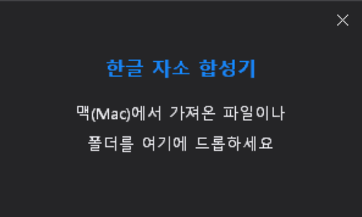

# JasoFixer (한글 자소 합성기)



맥(Mac)에서 윈도우(Windows)로 파일을 옮겼을 때 한글 파일명이 "ㅎㅏㄴㄱㅡㄹ"과 같이 자소가 분리되는 현상을 해결해주는 초간단 유틸리티입니다.

> **이 프로젝트는 바이브 코딩으로 제작되었습니다.** 🚀

## 🛠 개발 환경 및 실행 요구 사항
- **언어 및 도구**: C++ (Win32 API)
- **OS**: Windows 10 이상 권장
- **실행**: 별도의 설치 없이 실행 파일(`.exe`)만으로 작동하는 포터블 방식입니다.

## ✨ 주요 기능
- **드래그 앤 드롭**: 파일이나 폴더를 프로그램 창 위로 끌어다 놓기만 하면 즉시 변환됩니다.
- **재귀적 처리**: 폴더를 드롭하면 하위 폴더의 모든 파일명까지 찾아내어 자동으로 정규화(NFC)합니다.
- **심플한 디자인**: 불필요한 테두리 없이 깔끔한 다크 모드 UI와 커스텀 닫기 버튼을 제공합니다.
- **편리한 이동**: 창의 어느 곳이든 마우스로 잡고 이동할 수 있습니다.

## 🚀 사용 위치 및 다운로드
맥 운영체제의 자소 분리(NFD) 방식 파일명을 윈도우 표준(NFC) 방식으로 일괄 변경하고 싶을 때 사용하세요.

최신 실행 파일은 **[GitHub Releases](https://github.com/your-repo/JasoFixer/releases)** 페이지에서 다운로드할 수 있습니다.

## 🛠 설치 및 빌드
Windows 환경에서 Visual Studio의 `nmake` 또는 제공된 `build.bat` 파일을 사용하여 빌드할 수 있습니다.

```bash
git clone https://github.com/your-repo/JasoFixer.git
cd JasoFixer
build.bat
```

## 📜 라이선스
이 프로젝트는 **MIT 라이선스** [LICENSE](LICENSE)에 따라 자유롭게 사용할 수 있습니다.